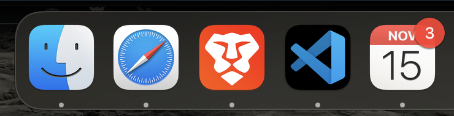
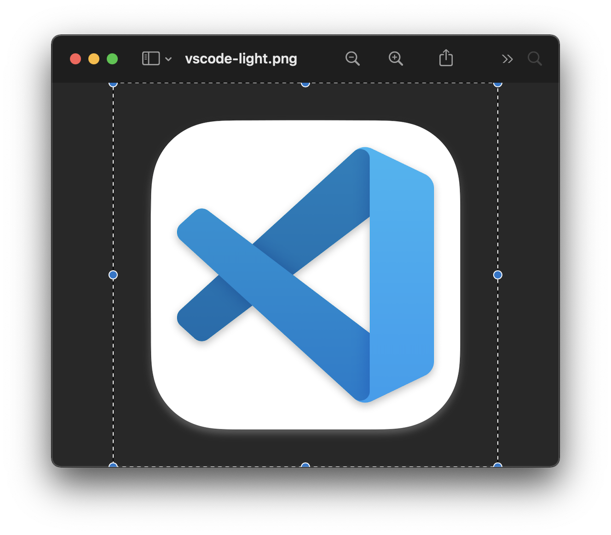
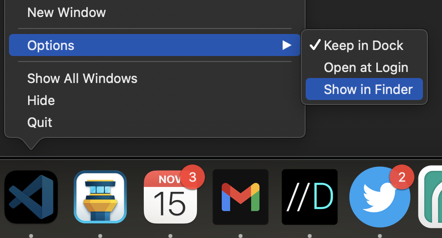
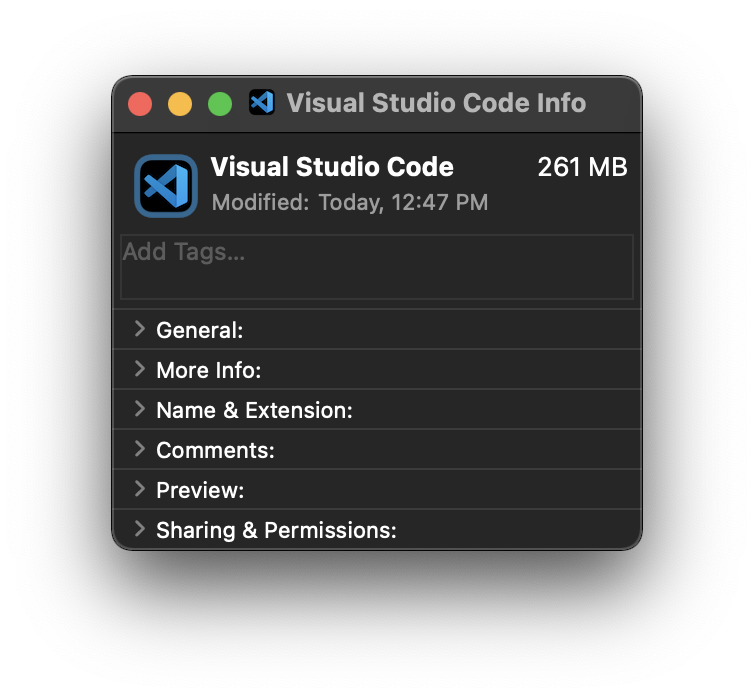

# big-sur-icons

<p align="center"></p>
<p align="center">A collection of re-imagined icons for popular apps in the macOS Big Sur style</p>
<hr />

Love it, hate it, or meh, the styling of macOS Bir Sur is here. I happen to like the new icons, but some of the pre-Big Sur icons look out of place. I set out to change that.

## Instructions

To change an icon, first download the icon you would like for your app. Next, open Preview and press `⌘`+`A` to select all, then press `⌘`+`C` to copy the image.

<p></p>

Go to the app in the dock, right-click, and select `Show in Finder`.

<p></p>

In the Finder window, right click on the app entry and select `Get Info`. A window will pop up. At the top left corner you should see a tiny picture of the app icon. Click once on the little photo so an outline will appear.

<p></p>

Press `⌘`+`V` to paste the image. If Finder asks for your password, put it in. Then, if the app you changed the icon for is open, quit it and open it again. You should see your new icon!

## Contribute

To add an icon to the list, create a folder under `icons`.

Next, use the Photoshop template in `/docs/big-sur-icon-template.psd` to create a png.

> If the icon is the pre-Big Sur one with a background, make both a light and a dark. For continuity, please use only solid white and black backgrounds for the image except if there is a valid reason not to.

Place the png(s) and the psd file in the folder. Optionally, create a `README` file with any needed explaination. Then create a pull request.

> Please use the naming convention of all lower case with dashes `-` between words.

For example, to add an icon for the popular Foo app:

```
/icons
  /brave
    brave.png
    brave.psd
  /foo
    foo-light.png
    foo-dark.png
    foo.psd
    README.md
```

## License

Icons are copyright of their respective owners and are licensed here under [MIT](./LICENSE)
